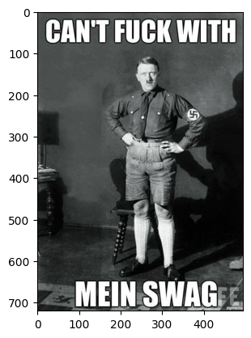
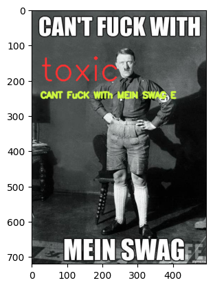
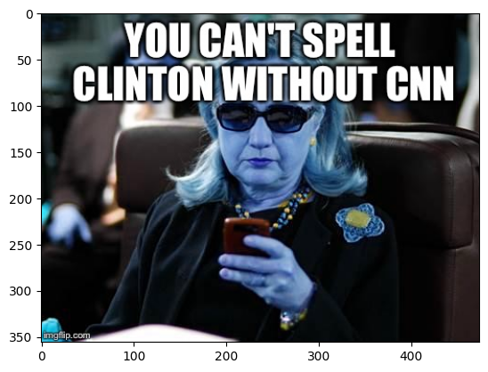
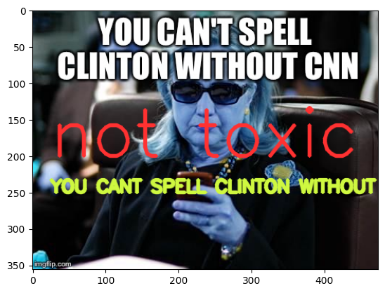

# Toxicity Detection in Memes | EVA Application

<table align="left">
  <td>
    <a target="_blank" href="https://colab.research.google.com/github/georgia-tech-db/toxicity-classification/blob/main/README.ipynb"> Run on Google Colab</a>
  </td>
  <td>
    <a target="_blank" href="https://github.com/georgia-tech-db/toxicity-classification/blob/main/README.ipynb"> View source on GitHub</a>
  </td>
  <td>
    <a target="_blank" href="
    https://raw.githubusercontent.com/georgia-tech-db/toxicity-classification/main/README.ipynb"> Download notebook</a>
  </td>
</table>
<br>
<br>

### Install Application Dependecies 


```python
!wget -nc "https://raw.githubusercontent.com/georgia-tech-db/toxicity-classification/main/requirements.txt"
!pip -q install -r requirements.txt
```

    File ‘requirements.txt’ already there; not retrieving.
    
    
    [notice] A new release of pip available: 22.2.2 -> 22.3.1
    [notice] To update, run: pip install --upgrade pip


### Start EVA server

We are reusing the start server notebook for launching the EVA server.


```python
!wget -nc "https://raw.githubusercontent.com/georgia-tech-db/eva/master/tutorials/00-start-eva-server.ipynb"
%run 00-start-eva-server.ipynb
cursor = connect_to_server()
```

    --2023-01-07 00:10:04--  https://raw.githubusercontent.com/georgia-tech-db/eva/master/tutorials/00-start-eva-server.ipynb
    Resolving raw.githubusercontent.com (raw.githubusercontent.com)... 185.199.109.133, 185.199.110.133, 185.199.108.133, ...
    Connecting to raw.githubusercontent.com (raw.githubusercontent.com)|185.199.109.133|:443... connected.
    HTTP request sent, awaiting response... 200 OK
    Length: 3970 (3.9K) [text/plain]
    Saving to: ‘00-start-eva-server.ipynb’
    
    00-start-eva-server 100%[===================>]   3.88K  --.-KB/s    in 0s      
    
    2023-01-07 00:10:04 (29.6 MB/s) - ‘00-start-eva-server.ipynb’ saved [3970/3970]
    
    nohup eva_server > eva.log 2>&1 &
    
    [notice] A new release of pip available: 22.2.2 -> 22.3.1
    [notice] To update, run: python -m pip install --upgrade pip
    Note: you may need to restart the kernel to use updated packages.


### Load the Memes for analysis


```python
!wget -nc "https://raw.githubusercontent.com/georgia-tech-db/toxicity-classification/main/meme1.jpg"
!wget -nc "https://raw.githubusercontent.com/georgia-tech-db/toxicity-classification/main/meme2.jpg"
cursor.execute('DROP TABLE IF EXISTS MemeImages;')
response = cursor.fetch_all()
print(response)
cursor.execute('LOAD IMAGE "meme1.jpg" INTO MemeImages;')
response = cursor.fetch_all()
print(response)
cursor.execute('LOAD IMAGE "meme2.jpg" INTO MemeImages;')
response = cursor.fetch_all()
print(response)
```

    File ‘meme1.jpg’ already there; not retrieving.
    
    File ‘meme2.jpg’ already there; not retrieving.
    
    @status: ResponseStatus.SUCCESS
    @batch: 
     Empty DataFrame
    Columns: []
    Index: []
    @query_time: 0.013611344853416085
    @status: ResponseStatus.SUCCESS
    @batch: 
                                0
    0  Number of loaded IMAGE: 1
    @query_time: 0.05462886509485543
    @status: ResponseStatus.SUCCESS
    @batch: 
                                0
    0  Number of loaded IMAGE: 1
    @query_time: 0.016247023129835725


### Create OCR Extractor UDF


```python
!wget -nc "https://raw.githubusercontent.com/georgia-tech-db/toxicity-classification/main/ocr_extractor.py"
cursor.execute("DROP UDF OCRExtractor;")
response = cursor.fetch_all()
print(response)
cursor.execute("""CREATE UDF IF NOT EXISTS OCRExtractor
      INPUT  (frame NDARRAY UINT8(3, ANYDIM, ANYDIM))
      OUTPUT (labels NDARRAY STR(ANYDIM), bboxes NDARRAY FLOAT32(ANYDIM, 4),
              scores NDARRAY FLOAT32(ANYDIM))
      TYPE  Classification
      IMPL  'ocr_extractor.py';
      """)
response = cursor.fetch_all()
print(response)
```

    File ‘ocr_extractor.py’ already there; not retrieving.
    
    @status: ResponseStatus.SUCCESS
    @batch: 
                                            0
    0  UDF OCRExtractor successfully dropped
    @query_time: 0.017284406116232276
    @status: ResponseStatus.SUCCESS
    @batch: 
                                                           0
    0  UDF OCRExtractor successfully added to the database.
    @query_time: 6.037804058985785


### Create Custom UDF for Toxicity Classification


```python
!wget -nc "https://raw.githubusercontent.com/georgia-tech-db/toxicity-classification/main/toxicity_classifier.py"
cursor.execute("DROP UDF IF EXISTS ToxicityClassifier;")
response = cursor.fetch_all()
print(response)
cursor.execute("""CREATE UDF IF NOT EXISTS ToxicityClassifier
                  INPUT  (text NDARRAY STR(100))
                  OUTPUT (labels NDARRAY STR(10))
                  TYPE  Classification
                  IMPL  'toxicity_classifier.py';
      """) 
response = cursor.fetch_all()
print(response)
```

    File ‘toxicity_classifier.py’ already there; not retrieving.
    
    @status: ResponseStatus.SUCCESS
    @batch: 
     Empty DataFrame
    Columns: []
    Index: []
    @query_time: 0.013038322096690536
    @status: ResponseStatus.SUCCESS
    @batch: 
                                                                 0
    0  UDF ToxicityClassifier successfully added to the database.
    @query_time: 1.6026825660374016


### Run Toxicity Classifier on OCR Extracted from Images


```python
cursor.execute("""SELECT OCRExtractor(data).labels,
                  ToxicityClassifier(OCRExtractor(data).labels)
                  FROM MemeImages;""")
response = cursor.fetch_all()
print(response)
```

    @status: ResponseStatus.SUCCESS
    @batch: 
                                  ocrextractor.labels toxicityclassifier.labels
    0                  [CANT FuCK WITh, MEIN SWAG E]                     toxic
    1  [YOU CANT SPELL, CLINTON WITHOUT CNN, igfip:]                 not toxic
    @query_time: 11.830992880044505


### Visualize Model Output on Images


```python
from pprint import pprint
from matplotlib import pyplot as plt
import cv2
import numpy as np

def annotate_image(detections, input_image_path, image_id):

    print(detections)

    color1=(207, 248, 64)
    color2=(255, 49, 49)
    thickness=4

    df = detections
    df = df[df.index == image_id]

    image = cv2.imread(input_image_path)

    if df.size:
        df_value_list = df.values
        ocr = ' '.join(df_value_list[0][0])
        label = df_value_list[0][1]
        print(label)

        plt.imshow(image)
        plt.show()

        cv2.putText(image, label, (25, 200), cv2.FONT_HERSHEY_SIMPLEX, 3, color2, thickness, cv2.LINE_AA) 

        cv2.putText(image, ocr, (25, 250), cv2.FONT_HERSHEY_SIMPLEX, 0.8, color1, thickness, cv2.LINE_AA) 

        plt.imshow(image)
        plt.show()        
```


```python
from ipywidgets import Image
dataframe = response.batch.frames
annotate_image(dataframe, 'meme1.jpg', image_id=0)
annotate_image(dataframe, 'meme2.jpg', image_id=1)
```

                                 ocrextractor.labels toxicityclassifier.labels
    0                  [CANT FuCK WITh, MEIN SWAG E]                     toxic
    1  [YOU CANT SPELL, CLINTON WITHOUT CNN, igfip:]                 not toxic
    toxic


    

    


    

    


                                 ocrextractor.labels toxicityclassifier.labels
    0                  [CANT FuCK WITh, MEIN SWAG E]                     toxic
    1  [YOU CANT SPELL, CLINTON WITHOUT CNN, igfip:]                 not toxic
    not toxic


    

    


    

    

